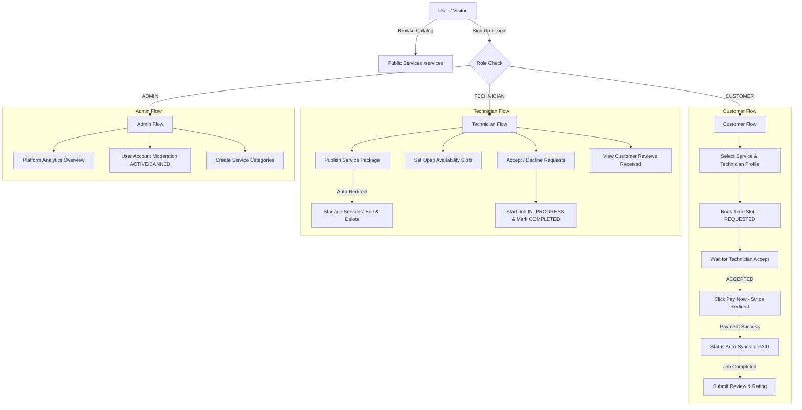

# FixItNow Frontend - Home Services Marketplace

FixItNow is a modern, responsive Next.js (App Router) frontend application for a home services marketplace. Built with TypeScript, Tailwind CSS, TanStack Query, and Stripe Checkout.

---

## 🔑 Working Demo Credentials

| Role | Email | Password | Phone | Name / Specialization |
| :--- | :--- | :--- | :--- | :--- |
| **Customer** | `customer@fixitnow.com` | `password123` | `+880 1711-998877` | Tariqul Islam (Tenant) |
| **Technician (Electrical)** | `tanvir.electric@gmail.com` | `password123` | `+880 1712-345678` | Engr. Tanvir Ahmed (DB Box & IPS) |
| **Technician (Plumbing)** | `rafiq.plumbing@gmail.com` | `password123` | `+880 1819-876543` | Md. Rafiqul Islam (Sanitary & Pumps) |
| **Technician (HVAC / AC)** | `mahmud.acservice@gmail.com` | `password123` | `+880 1911-234567` | Kazi Mahmud Hasan (Inverter AC Jet Wash) |
| **Technician (Carpentry)** | `naimur.carpenter@gmail.com` | `password123` | `+880 1615-998877` | Naimur Rahman (Cabinet & Locks) |

*(Note: You can use the **Quick Demo Buttons** on the `/auth/login` page to autofill Customer or Technician credentials with a single click. Admin account logs in manually).*

---

## Demo Services Included

1. **DB Box Installation & Full House Rewiring** (`$35.00`) - Engr. Tanvir Ahmed
2. **IPS & Generator Line Connection & Servicing** (`$25.00`) - Engr. Tanvir Ahmed
3. **Emergency Short-Circuit Repair & Load Balancing** (`$18.00`) - Engr. Tanvir Ahmed
4. **Water Submersible Pump Repair & Pipeline Unblocking** (`$30.00`) - Md. Rafiqul Islam
5. **Sanitary Fitting & Concealed Pipe Leak Sealing** (`$22.00`) - Md. Rafiqul Islam
6. **Inverter AC Master Jet Wash & Filter Cleaning** (`$20.00`) - Kazi Mahmud Hasan
7. **AC Gas Refill (R32 / R410a) & Copper Pipe Repair** (`$45.00`) - Kazi Mahmud Hasan
8. **Modular Kitchen Cabinet Repair & Lock Fitting** (`$20.00`) - Naimur Rahman

---

## 🔄 System Workflow & User Journeys



### Detailed Role Workflows:

#### 1. 👤 Customer Journey
- **Registration & Sign In**: Newly registered users automatically log in and land on the homepage `/`.
- **Marketplace Browsing**: Filter services at `/services` by category, title, price range, and rating. Functional pagination allows smooth Previous/Next navigation.
- **Appointment Booking**: Select a provider profile at `/technicians/[id]`, pick an open time slot, and submit the booking request (`REQUESTED`). *Technician accounts are restricted from booking services*.
- **Stripe Checkout Payment**: Once the technician accepts (`ACCEPTED`), click **Pay Now** to launch Stripe Checkout. After card payment, the system redirects to `/payment/success`, auto-syncs booking status to `PAID`, and displays **Payment Completed**.
- **Ratings & Reviews**: After job completion, submit a rating (1-5 stars) and feedback text. The button automatically transitions to `✓ Review Submitted`.

#### 2. 🛠️ Technician (Provider) Journey
- **Service Package Management**: Post new service offerings via `/dashboard/technician/services` (automatically redirects to dashboard upon success).
- **Service Listings Controls**: On the dashboard's **My Published Services** table, click ✏️ **Edit** to update service title, price, duration, or description, or click 🗑️ **Delete** to remove listings.
- **Availability Calendar**: Set open date and time slots at `/dashboard/technician/availability`.
- **Job Execution**: Accept or decline incoming requests (`REQUESTED` -> `ACCEPTED` -> `IN_PROGRESS` -> `COMPLETED`).
- **Customer Reviews Segment**: View customer reviews and star ratings received for completed jobs specifying Customer Name, Rating, Service Job Title, Comment, and Date.

#### 3. 🛡️ Admin Journey
- **Manual Authentication**: Sign in using Admin credentials (`admin123@gmail.com` / `12345`).
- **User Moderation**: Access `/dashboard/admin` to search registered users and toggle account statuses between `ACTIVE` and `BANNED`.
- **Category Management**: Create new service categories at `/dashboard/admin/categories`. Newly added categories instantly populate marketplace filter options for all visitors.

---

## 🚀 Tech Stack

- **Framework**: Next.js 14/15 App Router (`app/` directory)
- **Language**: TypeScript (Strict mode enabled)
- **Styling**: Tailwind CSS with custom glassmorphism design system
- **State Management & Fetching**: TanStack React Query v5 + Auth Context
- **Authentication**: JWT token management stored in Cookies + Next.js Middleware route protection
- **Payment Gateway**: Stripe Checkout Session Redirect Integration
- **Notification & Error UI**: `react-hot-toast` (2.5s duration with interactive `X` dismiss button) + App Router `error.tsx` & `loading.tsx`

---

## 🛠️ Getting Started

### 1. Environment Setup
Create a `.env.local` file in the root directory:
```env
NEXT_PUBLIC_API_BASE_URL=http://localhost:3000/api
NEXT_PUBLIC_APP_URL=http://localhost:3001
```

### 2. Install Dependencies
```bash
npm install
```

### 3. Run Development Server
```bash
npm run dev
```
Open [http://localhost:3001](http://localhost:3001) in your browser.

---

## 📋 Additional Key Features

1. **Role Enforcement**: Technicians cannot book services like customers (`"Logged in as a Technician. Only Customer accounts can book services"`).
2. **Unified Public Services Catalog**: All users, visitors, and technicians browse the exact same real-time database service offerings.
3. **Responsive Toast Feedback**: Shortened popup duration (`2500ms`) with close cross buttons for clean user experience.
4. **Middleware Security**: Automatically guards `/dashboard/customer`, `/dashboard/technician`, and `/dashboard/admin` based on JWT token claims.
